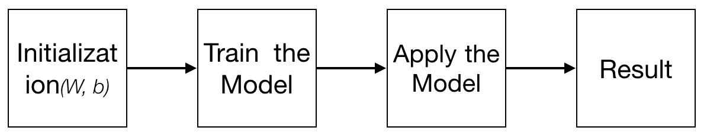
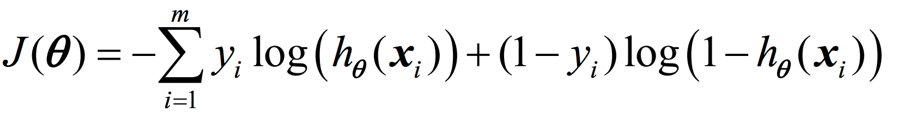
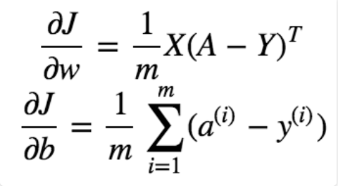
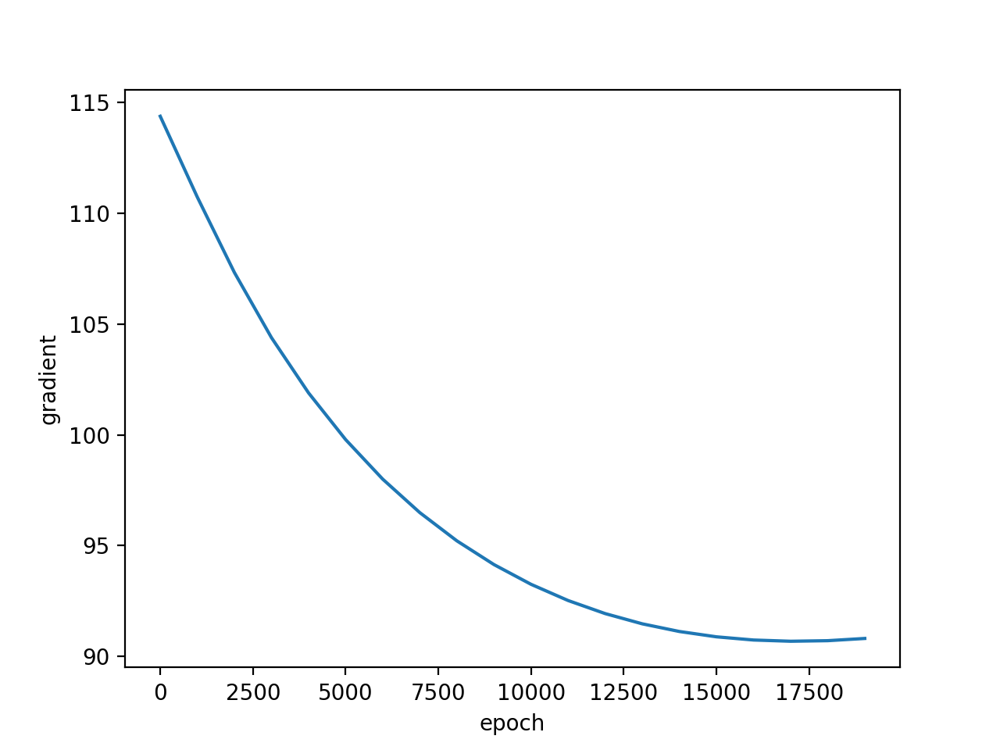
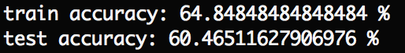
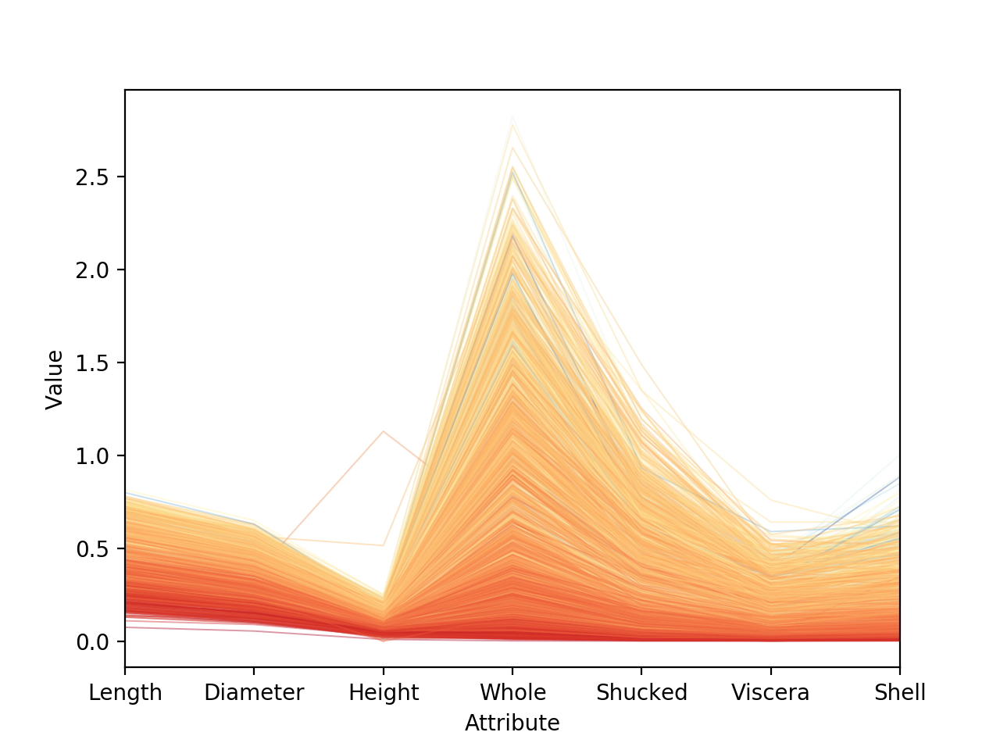
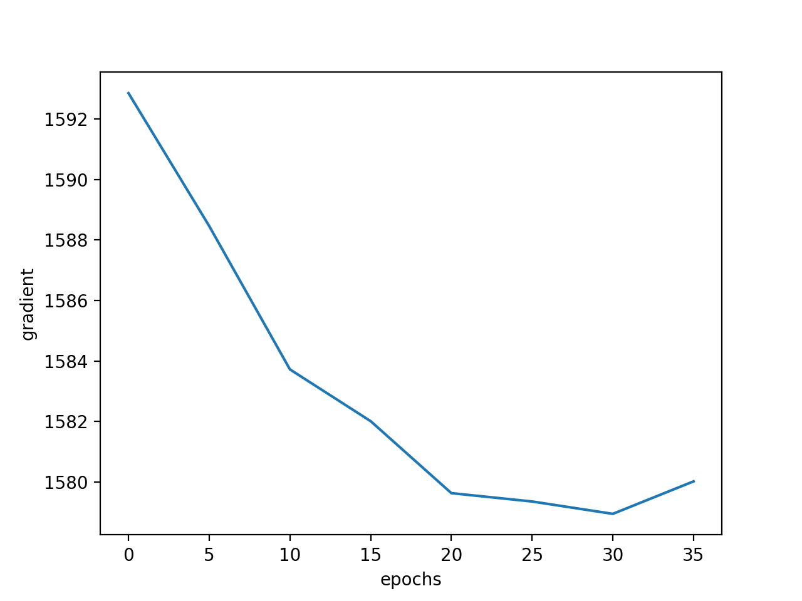
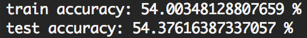

# Report

Author: Cheng PENG 

Student ID: 1731536

Email: tjupengcheng@163.com

## 1.Overview

This report will introduce 2 datasets, the [Sonar](http://archive.ics.uci.edu/ml/datasets/Connectionist+Bench+%28Sonar%2C+Mines+vs.+Rocks%29) dataset and the [Abalone](http://archive.ics.uci.edu/ml/datasets/Abalone) dataset, all come from UCI Machine Learning Repository. the report was divided into 2 parts, in each part, the detailed information of the dataset will be given respectively, including the main characteristics、data preprocessing operation、design of the classification model、the result and interpretation of the result, and the limitation and possible improvements of the program.

## 2.Sonar

### 2.1 Main Characteristics

change current directory to /Sonar, run

	python dataAnalysis.py

you will get a dataAnalysis.txt file which contain the analysis of the dataset, Here is the detailed information of the dataset:

* There are 208 individuals in this dataset, each contain 61 attributes, the first 60 is numerical values(range 0.0 to 1.0), the last one is a label string that contains a single character;

* There are 2 labels of the dataset, 'M'(for Mines) and 'R'(for Rocks), and the number of 'M' is 111 while the number of 'R' is 97;

* For the 60 numerical values, the the mean of the dataset is 0.0538923076923, the standard deviation is 0.0464159832226, and the values of attribute showed below(Red line for Miners while Black line for Rocks):

### 2.2 Data Preprocessing Operation

As there is no missing value in this dataset, so we don't take any preprocessing operation for this original dataset.

For the sake of setting the threshold, in the building process of the model, we set M = 1 and R = 0 while calculate the accuracy of the model.

### 2.3 Model

if you run

	python logisticRegression.py

you will run the logistic regression model and get the result(you can also tune the parameters in the program to get different output), here is the design of the model:

More details:

* Used forward propagation and backward propagation to learn the parameters, and the Cost Function was setted as via the courese slide:

* the formulas used for update the parameters as follow:

(Note: inspired by [Andrew Ng's course](https://www.coursera.org/learn/neural-networks-deep-learning/home/welcome))

* those parameters can be tuned: learning rate, iteration number, threshold

The main functions used are as follow:

	sigmoid(z) -- accept a number or matrix, return the sigmoid value.
	init(dim) -- initilize the weight and bias.
	propagate(w, b, X, Y) -- calculate the cost function(via the course slides) and get the dw and db.
	optimize(w, b, X, Y, num_iter, learning_rate -- update the parameters via gradient descent.
	predict(w, b, X) -- test the model trained by the previous steps, and set the threshold of the model.
	model(X_train, Y_train, X_test, Y_test, num_iter, learning_rate) -- wrap up all the functions together and get a result.  
	

### 2.4 Result and Reason

Using Gradient Descent and set the epoches = 20000, learning rate = 0.001, threshold = 0.5, the result as follow:

we can see that with the increase of the number of iterations, the gradient was converged after about 17500 iterations.

and the accuracy showed below:

The result seems not very exciting, mabye the parameters can be tuned better (althrough I have tried many times, this is relatively a good one).

(Note: as there exists so many attributes for a individual, a figure for decision boundary is not so straightforward, we ignored here.)

### 2.5 Limitation and Improvement

There are two main limitations in this program:

* Using a single logistic regression layer to build a model is sometimes so weak, maybe use a multi-layer neural network can get a better result;

* the dataset is a little bit small, it seems not enough for train a very accurate model.

## 3.Abalone

### 3.1 Main Characteristics

change current directory to /Abalone, run

	python dataAnalysis.py

you will get a dataAnalysis.txt file which contain the analysis of the dataset, Here is the detailed information of the dataset:

* There are 4177 individuals in this dataset, each contain 9 attributes, the first is a string values('F', 'I', and 'M'),  other attribute are all numerical. and the number of 'F'、'I' and 'M' are 1307, 1342 and 1528 respectively;

* For the numerical values, the the mean of the dataset is 0.13951639933, the standard deviation is 0.0418220494777, and the values of attribute showed as follow:

### 3.2 Data Preprocessing Operation

In most cases, this dataset was use for a regression problem, concretely, people used the first 8 attributes to predict the last attribute(rings). howerver, as logistic regression is powerful in binary classification problem, we used the 8 numerical attributes to predict sex, to convert this problem to a binary classification, we cut those individuals with 'I' and do the experiment in those data with 'F' or 'M';

change current directory to /Abalone, run
	
	python preprocessing.py
	
you will get a training dataset and a testing dataset with a 80% / 20% distribution.

### 3.3 Model

the model follow 2.3, just modify some parameter to fit this problem.

### 3.4 Result and Reason

Using Gradient Descent and set the epoches = 40, learning rate = 0.06, threshold = 0.5, the result as follow:

we can see that with the increase of the number of iterations, the gradient was converged after about 35 iterations.

and the accuracy showed below:

the result is not so delighted, we tried many parameters for a better model, but seems the 8 attributes have little relation with the sex of abalone.

### 3.5 Limitation and Improvement

from the "No Free Lunch Theorem", no matter what elegent-designed algorithm we take, if there exists little or even no relation between the datas, the result cannot be train as good as those data with strong relations, so this dataset is not so suitable for the classification of sex for abalone.

## 4.Reference

Most of my inspiration comes from the sildes in the course, and the model comes from the [Deeplearning.ai](https://www.deeplearning.ai/) course by Andrew Ng.

By the way, there is another good dataset to build a classifier of cats and I have get a great result, but unfortunately the dataset is not opened, if you have interest, you can see my idea in the below blogs:

* [Logistic回归实现猫分类器](http://pengcheng.tech/2017/09/17/logistic-regression%E5%AE%9E%E7%8E%B0%E7%8C%AB%E5%88%86%E7%B1%BB%E5%99%A8/)

* [使用单层神经网络构建分类器](http://pengcheng.tech/2017/09/19/%E4%BD%BF%E7%94%A8%E5%8D%95%E5%B1%82%E7%A5%9E%E7%BB%8F%E7%BD%91%E7%BB%9C%E6%9E%84%E5%BB%BA%E5%88%86%E7%B1%BB%E5%99%A8/)

* [神经网络实现猫分类器](http://pengcheng.tech/2017/09/24/%E7%A5%9E%E7%BB%8F%E7%BD%91%E7%BB%9C%E5%AE%9E%E7%8E%B0%E7%8C%AB%E5%88%86%E7%B1%BB%E5%99%A8/)

Thank you for you time.