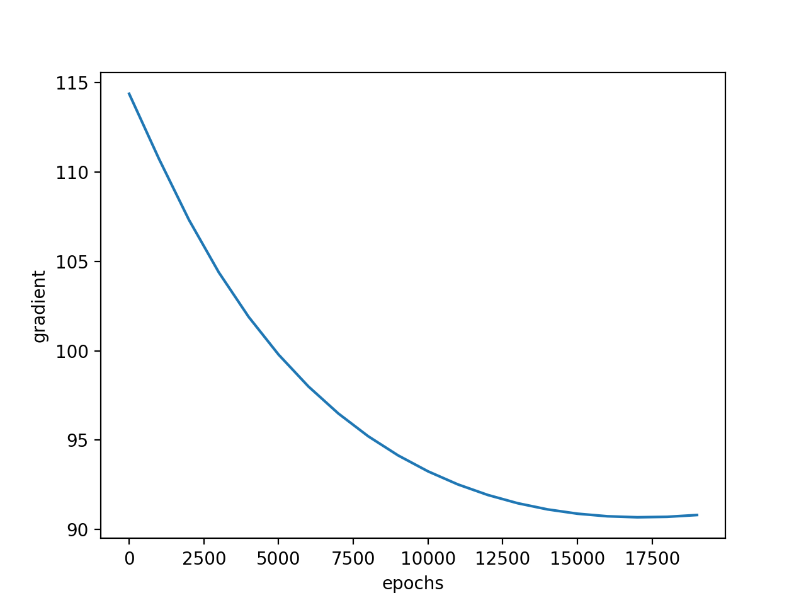

# Report

Author: Cheng PENG 

Student ID: 1731536

Email: tjupengcheng@163.com

## 1.Overview

This report will introduce 2 datasets, the [Sonar](http://archive.ics.uci.edu/ml/datasets/Connectionist+Bench+%28Sonar%2C+Mines+vs.+Rocks%29) dataset and the [Abalone](http://archive.ics.uci.edu/ml/datasets/Abalone) dataset, all come from UCI Machine Learning Repository. the report was divided into 2 parts, in each part, the detailed information of the dataset will be given respectively, including the main characteristics、data preprocessing operation、design of the classification model、the result and interpretation of the result, and the limitation and summary of the program.

## 2.Sonar

### 2.1 Main Characteristics

change cd to /Sonar, run

	python dataAnalysis.py

you will get a dataAnalysis.txt file, Here is the detailed information of the dataset:

* There are 208 individuals in this dataset, each contain 61 attributes, the first 60 is numerical values(range 0.0 to 1.0), the last one is a string that contain a single character;

* For 60 numerical values, the the mean of the dataset is 0.0538923076923, the standard deviation is 0.0464159832226;

* There are 2 labels of the dataset, 'M'(for Mines) and 'R'(for Rocks), and the number of 'M' is 111 while the number of 'R' is 97;

### 2.2 Data Preprocessing Operation

As there is no missing value in this dataset, so we don't take any preprocessing operation for this original dataset.

For the sake of setting the threshold, in the building process of the model, we set M = 1 and R = 0 while calculate the accuracy of the model.

### 2.3 Model

if you run

	python logisticRegression.py

you will run the logistic regression model and get the result(you can also tune the parameters in the program to get different output), here is the design of the model:

	sigmoid(z) -- accept a number or matrix, return the sigmoid value.
	init(dim) -- initilize the weight and bias.
	propagate(w, b, X, Y) -- calculate the cost function(via the course slides) and get the dw and db.
	optimize(w, b, X, Y, num_iter, learning_rate -- update the parameters via gradient descent.
	predict(w, b, X) -- test the model trained by the previous steps, and set the threshold of the model.
	model(X_train, Y_train, X_test, Y_test, num_iter, learning_rate) -- wrap up all the functions together and get a result.  

### 2.4 Result and Reason

Using Gradient Descent and set the epoches = 20000, the result showed below:

and the accuracy showed below:

we can see the result is not so exciting, mabye the parameter is not well tuned.

### 2.5 Limitation and Improvement

There are two main limitations in this program:

* Using a single logistic regression layer to build a model is sometimes so weak, maybe use a multi-layer neural network can get a better result;

* the dataset is little big small, let's try a bigger one. 

## 3.Abalone

### 3.1 Main Characteristics

### 3.2 Data Preprocessing Operation

### 3.3 Model

### 3.4 Result and Reason

### 3.5 Limitation and Improvement

