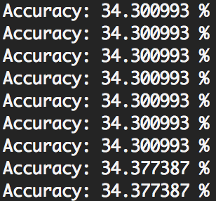
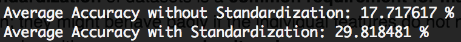

# REPORT

Author: Cheng PENG (彭程)

Student ID: 1731536

Email: tjupengcheng@163.com

## 1.Overview

todo

## 2.Titanic Dataset

### 2.1 Main Characteristics

The titanic dataset describe the survival status of individual passengers (not all) on the Titanic . it's a .xls file, and the size of the raw dataset is **1309** (number of passengers) * **14** (variables), Here is the detailed variables information:

| Variable | Definition | Key | DataType (Python) |  Addition |
| --- | --- | --- | --- | --- |
| pclass | Ticket class | 	1=1st 2=2nd 3=3rd | int64 |1st = Upper   2nd = Middle   3rd = Lower |
| survived | 	Survival | 0=No 1=Yes | int64 | |
| name | Name  | | object | |
| sex | Sex | | object | |
| age | Age in years | | float64 |Age is fractional if less than 1. If the age is estimated, is it in the form of xx.5 |
| sibsp | # of siblings / spouses aboard the Titanic |  | int64 | Sibling = brother, sister, stepbrother, stepsister Spouse = husband, wife (mistresses and fiancés were ignored) |
| parch | 	# of parents / children aboard the Titanic |  | int64 | Parent = mother, father   Child = daughter, son, stepdaughter, stepson   Some children travelled only with a nanny, therefore parch=0 for them. |
| ticket | Ticket number | | object | |
| fare | 	Passenger fare | | float64 | |
| cabin | Cabin number | | object | |
| embarked | 	Port of Embarkation | C Q S | object |	 C = Cherbourg   Q = Queenstown   S = Southampton |
| boat | Lifeboat | | object | |
| body | Body Identification Number | | float64 | |
| home.dest | Home/Destination | | object | |

From the form above-mentioned, we can see that some information (like home.dest, name) has nothing to do with the probability of survival intuitively, we need get rid of them to get a reasonable cluatering on out task, and some necessary information (like sex) need some data preprocessing step to transfer them to numerical value for our task.

### 2.2 Data Preprocessing

As the purpose of our task is to divide the whole dataset into to 2 cluster (survived or not), so the data preprocessing can be divided into 2 parts:

* Drop Columns

	we drop those columns before clustering: 
	
	* survived (as this is the main task for clustering, we need transfer the problem to a unsupervised problem).

	* name, body, home.dest, ticket (as those columns have nothing to do with the problem intuitively).

* Transfer Non-Numerical Data to Numerical	
	we need to transfer those columns that are non-numerical to numerical before apply k-means, they are sex, cabin, embarked, boat.
	
	we use a numerical array which is increase progressively to save transfer those non-numerical data, for instance, we use '0' for 'female' and '1' for 'male' for sex column.

By the way, as the dataset is not fully completed, there exists some vacancies, we set the default value equals 0.

### 2.3 Model

The main design of the model including 3 parts:

* we used the *preprocess* function to decrease drop the unnecessary data and form a pure numerial version of data.

* define the class K_Means, which including some variables (*k*, num of clusters and default is 2; *critical*, the critical value of end the interation and default is 0.001, *max_iter*, default is 1000). In this class, the *cluster* is the main function for kmeans, which is used SSE(sum of the squared error) as the metric for clustering.

* use the *classify* to see the result and compare with ground-truth, which means the passenger survived or not.

### 2.4 Result and Reasoning

As the dataset is multi-dimensions, it's not intuitionistic to plot the whole result and compare with ground-truth. we get the accuracy by compare with the ground-truth. The screenshot as follow:

as we just set the original centroids as the first two data of the raw dataset, so the result is relatively stable, but the accuracy is not that good.

Compared with many initial centroids, we can conclude that the accuracy is highly related to the original centroid (sometimes can even to 80%), that may because we have not standardize the dataset, especially the translation from non-numerical data to numerical data is too ordinary.

### 2.5 Limitation and Improvement

The main limition of the dataset and improvement can be divided into two parts:

* the choose of K, as mentioned above, the initial of K has great impact to the final result, we may use some Statistics method for that, or compare many result to pick the best one.

* the Standardization of data, as the tranfer stage is not standardize, we can use mean removal and variance scaling to get a better result for that, and here is a simple comparision of accuracy for this (100 iterations, same initial centroids, and we use the preprocessing package which is integrated in scikit-learn):

we can see that some other preprocessing step can imporve the result sometimes.

## 3.TODO

### 3.1 Main Characteristics

### 3.2 Data Preprocessing Operation

### 3.3 Model

### 3.4 Result and Reason

### 3.5 Limitation and Improvement

## 4.Reference

* [Titanic Datasets](http://campus.lakeforest.edu/frank/FILES/MLFfiles/Bio150/Titanic/TitanicMETA.pdf)

* [Titanic: Machine Learning from Disaster (Kaggle Homepage)](https://www.kaggle.com/c/titanic/data) 

* [Handling Non-Numerical Data for Machine Learning](https://pythonprogramming.net/working-with-non-numerical-data-machine-learning-tutorial/)

Thank you for your time.