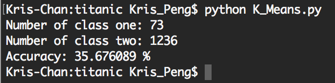
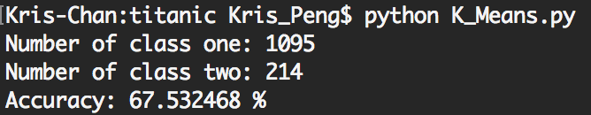
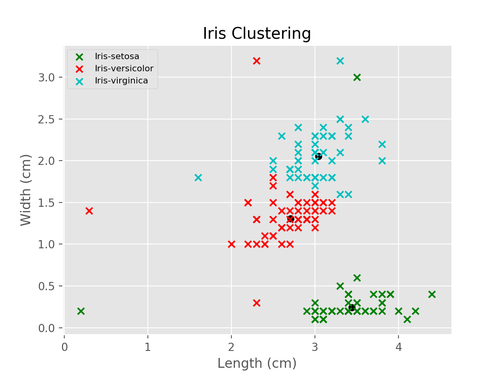
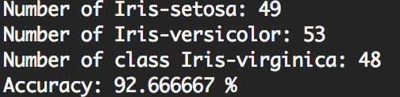
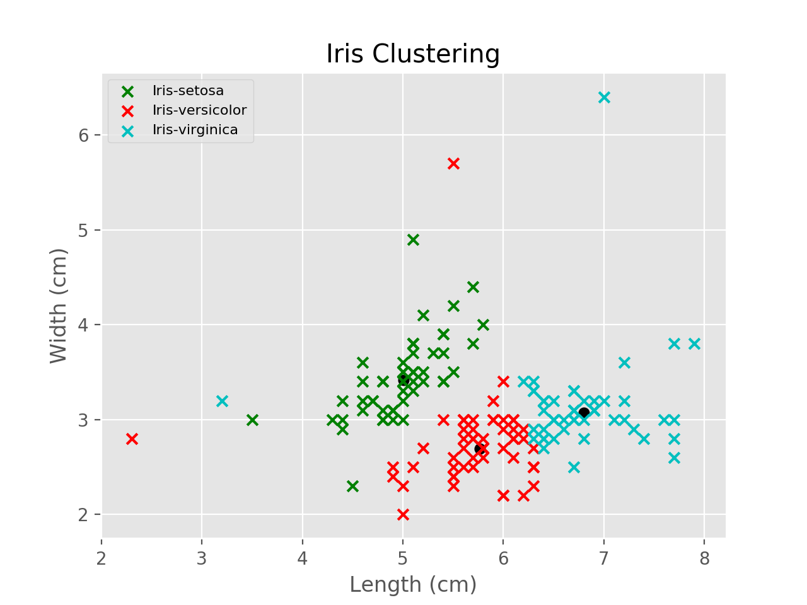
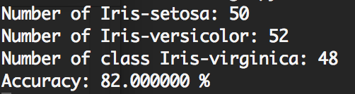

# REPORT

Author: Cheng PENG (彭程)

Student ID: 1731536

Email: tjupengcheng@163.com

## 1.Overview

In this task, I used two datasets for clustering, the first one is the titanic dataset, which describes the information of individual passengers on the Titanic, the clustering task is to generate two clusters (survived or not) and compare with the ground-truth. The second dataset is the classical Iris dataset. I uesd K-means for those two dataset in this report. I have tried other clustering methods for that, like Hierarchical clustering or Mean shift, but I failed to get reasonable result (maybe the dataset is not suitable).

**Note: No Framework was used in this task, I have just used numpy for some list operation(add, subtract), as write for loops for that seems redundant.**

## 2.Titanic Dataset

### 2.1 Main Characteristics

The titanic dataset describe the survival status of individual passengers (not all) on the Titanic . it's a .xls file, and the size of the raw dataset is **1309** (number of passengers) * **14** (variables), Here is the detailed variables information:

| Variable | Definition | Key | DataType (Python) |  Addition |
| --- | --- | --- | --- | --- |
| pclass | Ticket class | 	1=1st 2=2nd 3=3rd | int64 |1st = Upper   2nd = Middle   3rd = Lower |
| survived | 	Survival | 0=No 1=Yes | int64 | |
| name | Name  | | object | |
| sex | Sex | | object | |
| age | Age in years | | float64 |Age is fractional if less than 1. If the age is estimated, is it in the form of xx.5 |
| sibsp | # of siblings / spouses aboard the Titanic |  | int64 | Sibling = brother, sister, stepbrother, stepsister Spouse = husband, wife (mistresses and fiancés were ignored) |
| parch | 	# of parents / children aboard the Titanic |  | int64 | Parent = mother, father   Child = daughter, son, stepdaughter, stepson   Some children travelled only with a nanny, therefore parch=0 for them. |
| ticket | Ticket number | | object | |
| fare | 	Passenger fare | | float64 | |
| cabin | Cabin number | | object | |
| embarked | 	Port of Embarkation | C Q S | object |	 C = Cherbourg   Q = Queenstown   S = Southampton |
| boat | Lifeboat | | object | |
| body | Body Identification Number | | float64 | |
| home.dest | Home/Destination | | object | |

From the form above-mentioned, we can see that some information (like home.dest, name) has nothing to do with the probability of survival intuitively, we need get rid of them to get a reasonable cluatering on out task, and some necessary information (like sex) need some data preprocessing step to transfer them to numerical value for our task.

### 2.2 Data Preprocessing

As the purpose of our task is to divide the whole dataset into to 2 cluster (survived or not), so the data preprocessing can be divided into 2 parts:

* Drop Columns

	we drop those columns before clustering: 
	
	* survived (as this is the main task for clustering, we need transfer the problem to a unsupervised problem).

	* name, body, home.dest, ticket (as those columns have nothing to do with the problem intuitively).

* Transfer Non-Numerical Data to Numerical	
	we need to transfer those columns that are non-numerical to numerical before apply k-means, they are sex, cabin, embarked, boat.
	
	we use a numerical array which is increase progressively to save transfer those non-numerical data, for instance, we use '0' for 'female' and '1' for 'male' for sex column.

By the way, as the dataset is not fully completed, there exists some vacancies, we set the default value equals 0.

### 2.3 Model

The main design of the model including 3 parts:

* we used the *preprocess* function to decrease drop the unnecessary data and form a pure numerial version of data.

* define the class K_Means, which including some variables (*k*, num of clusters and default is 2; *critical*, the critical value of end the interation and default is 0.001, *max_iter*, default is 1000). In this class, the *cluster* is the main function for kmeans, which is used SSE(sum of the squared error) as the metric for clustering.

* use the *classify* to see the result and compare with ground-truth, which means the passenger survived or not.

### 2.4 Result and Reasoning

As the dataset is multi-dimensions, it's not intuitionistic to plot the whole result and compare with ground-truth. we get the accuracy by compare with the ground-truth. The screenshot as follow:

 Figure1: use the frist and second point as centroids

 Figure2: use the 101 and 102 point as centroids

we can see that the clustering result is highly related to the choose of centroids. as this problem got not very intuitive standard, the choose of initial k has great impact to the final result.

### 2.5 Limitation and Improvement

The main limition of the dataset and improvement can be divided into two parts:

* the choose of K, as mentioned above, the initial of K has great impact to the final result, we may use some Statistics method for that, or compare many result to pick the best one.

* the Standardization of data, as the tranfer stage is not standardize, we can use mean removal and variance scaling to get a better result for that, and here is a simple comparision of accuracy for this (100 iterations, same initial centroids, and we use the preprocessing package which is integrated in scikit-learn):

 Figure3: Standardization vs not Standardization 

we can see that some other preprocessing step can imporve the accuracy (not always).

## 3.Iris Dataset

### 3.1 Main Characteristics

Iris is perhaps the best known dataset to be found in the pattern recognition literature. The dataset contains 3 classes of 50 instances each, where each class refers to a type of iris plant. One class is linearly separable from the other 2, the attribute information as follow:

| Variable | Unit | Addition |
| --- | --- | --- |
| sepal length | cm |  |
| sepal width | cm |  |
| petal length | cm |  |
| petal width | cm |  |
| class |  |  Iris Setosa Iris / Versicolour / Virginica|

### 3.2 Data Preprocessing Operation

For visualization and control variables, I used the sepal length/width and petal width to cluster respectively, and I transfered the 3 classes to 0,1,2 for convenient.

### 3.3 Model

The main idea is K-means which mentioned above, just slightly difference on the variables control.

### 3.4 Result and Reason

I have compared the different of using sepal and petal for clustering, here is the result:

* Sepal

 Figure4: clustering of petal 

 Figure5: accuracy of petal 

* Petal

 Figure6: clustering of sepal 

 Figure7: accuracy of sepal 

As we used the same set of centroids and hyperparameters, we can see that the result of using petal is better than sepal, and if we used all the 4 attributes for clustering, the result is not static, mostly between the accuracy of sepal and petal, but the clustering result is stable with different centroids, that because the different between those 3 kinds of flowers is obvious, the machine can learn the result from those different data.

### 3.5 Limitation and Improvement

the improvement can be divided into two parts:

* K-means seems a very basic method for this dataset, Hierarchical clustering seems another option for that, or mean shift.

* As the datset exists no noise data, tuning the parameter may get a better result. 

## 4.Reference

* [Titanic Datasets](http://campus.lakeforest.edu/frank/FILES/MLFfiles/Bio150/Titanic/TitanicMETA.pdf)

* [Titanic: Machine Learning from Disaster (Kaggle Homepage)](https://www.kaggle.com/c/titanic/data) 

* [Handling Non-Numerical Data for Machine Learning](https://pythonprogramming.net/working-with-non-numerical-data-machine-learning-tutorial/)

* [Iris Plants Database](https://archive.ics.uci.edu/ml/datasets/iris)

Thank you for your time.